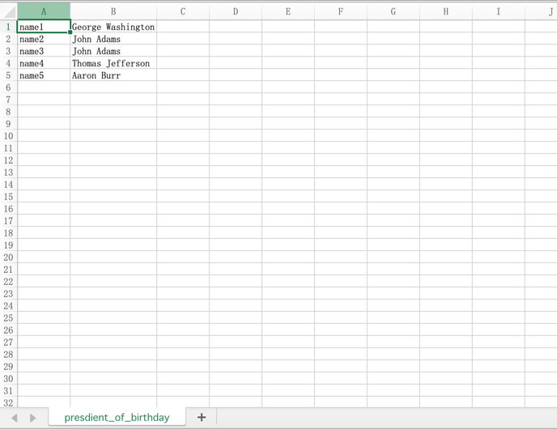

# excelExport
将json数据导出为excel
> 可将json数据纵向导出为excel
> 
> 可将json数据横向导出为excel
>
> 单元格列宽自适应

#### Install
```
npm install @nepoch/json2excel
```

#### Examples
##### esm环境
```
开发中...
```
##### esm环境
```
开发中...
```
##### umd环境
```
var jexcel=require('json2excel');
 
var data = {
    sheets: [{
        header: {
            'author': 'authorName',
            'title': 'title'
        },
        items: [
         {
            author:'john',
            title:'how to use this'
         },
         {
            author:'Bob',
            title:'so Easy'
         }
        ],
        sheetName: 'sheet1',
    }],
    filepath: 'j2x.xlsx'
} 
 
jexcel.j2e(data,function(err){ 
    console.log('finish')
});
```
#### 效果
1. 纵向导出

2. 横向导出


#### Notice
- 工作表字符长度不能超过31个
- 单元格字符长度不能超过32727个
