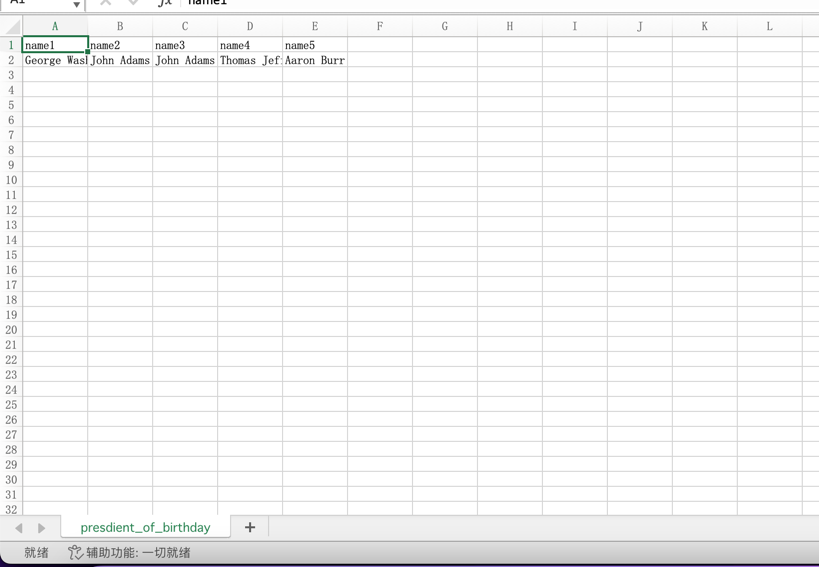

# excelExport
将json数据导出为excel
> 广泛适配excel文件格式
> 
> 可将json数据纵向导出为excel
> 
> 可将json数据横向导出为excel
>
> 单元格列宽自适应

#### Install
```
npm install json2excel_convert
```

#### Examples
##### esm环境
```
import json2excel from 'json2excel_convert'

const xlsxData = [
    {
        "sheetName": "presdient_of_birthday",
        "sheetData": [
            {
                "name": "George Washington"
            },
            {
                "name": "John Adams",
            },
            {
                "name": "John Adams",
            },
            {
                "name": "Thomas Jefferson",
            },
            {
                "name": "Aaron Burr",
            }
        ]
    }
]
function handleExport() {
    json2excel({
        fileName: 'presdient_birthday.xlsx',
        data: xlsxData,
        direction: 0 //0-纵向导出，1-横向导出
    })
}
```
##### cjs环境
```
const json2excel = require('json2excel_convert')
const xlsxData = [
    {
        "sheetName": "presdient_of_birthday",
        "sheetData": [
            {
                "name": "George Washington"
            },
            {
                "name": "John Adams",
            },
            {
                "name": "John Adams",
            },
            {
                "name": "Thomas Jefferson",
            },
            {
                "name": "Aaron Burr",
            }
        ]
    }
]

json2excel({
    fileName: 'presdient_birthday.xlsx',
    data: xlsxData,
    direction: 0 //0-纵向导出，1-横向导出
})
```
##### umd环境
```
const xlsxData = [
    {
        "sheetName": "presdient_of_birthday",
        "sheetData": [
            {
                "name": "George Washington"
            },
            {
                "name": "John Adams",
            },
            {
                "name": "John Adams",
            },
            {
                "name": "Thomas Jefferson",
            },
            {
                "name": "Aaron Burr",
            }
        ]
    }
]
function handleExport() {
    json2excel({
        fileName: 'presdient_birthday.xlsx',
        data: xlsxData,
        direction: 0 //0-纵向导出，1-横向导出
    })
}
```
#### 效果
1. 纵向导出

2. 横向导出



#### Notice
- [工作表字符长度][Excel 规范与限制]不能超过31个
- [单元格字符长度][Excel 规范与限制]不能超过32727个


[Excel 规范与限制]:https://support.microsoft.com/zh-cn/office/excel-%E8%A7%84%E8%8C%83%E4%B8%8E%E9%99%90%E5%88%B6-1672b34d-7043-467e-8e27-269d656771c3
